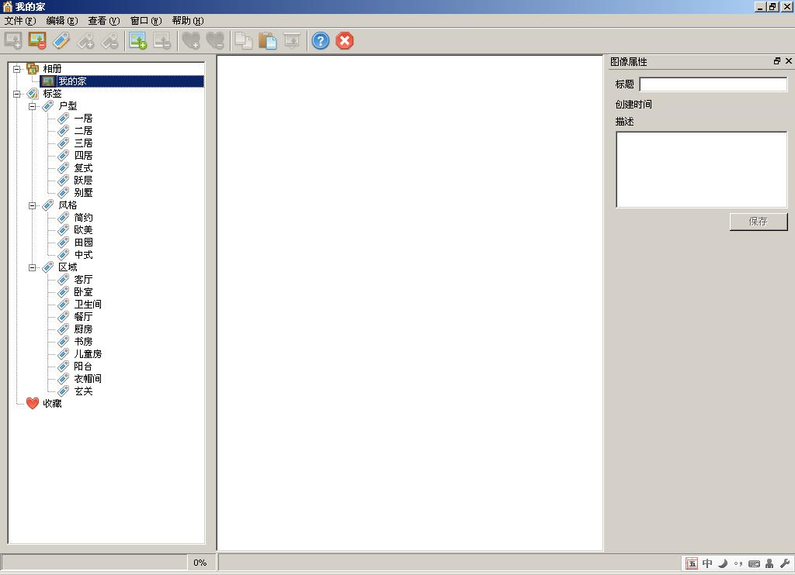
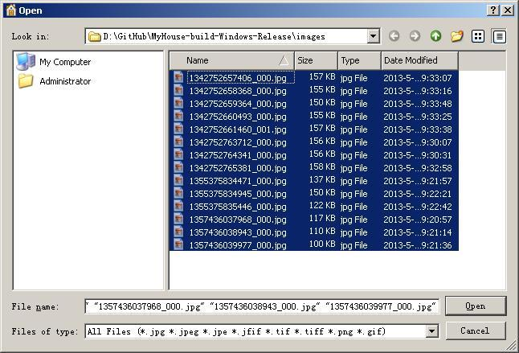
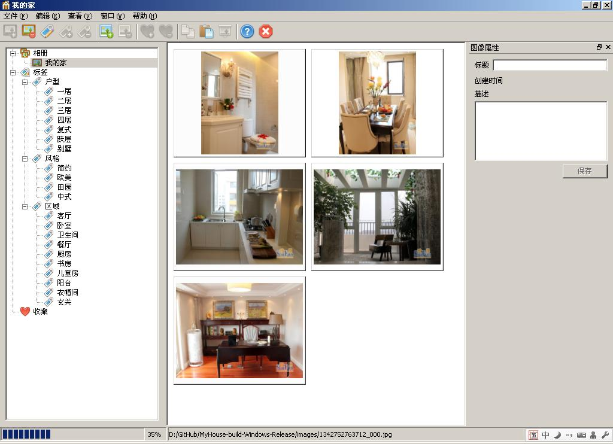
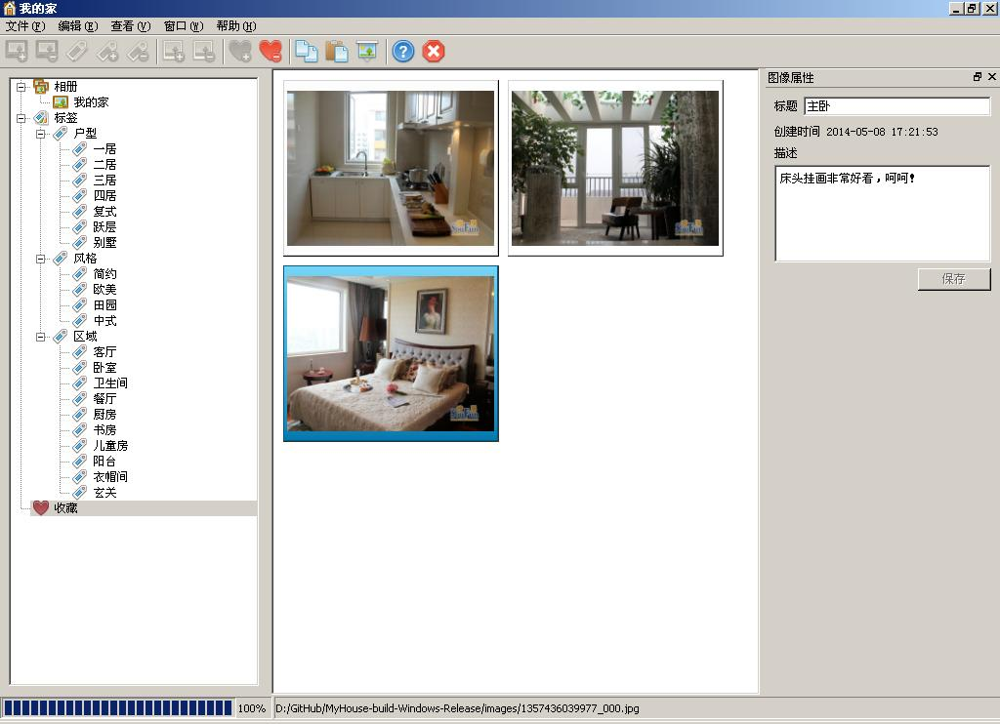
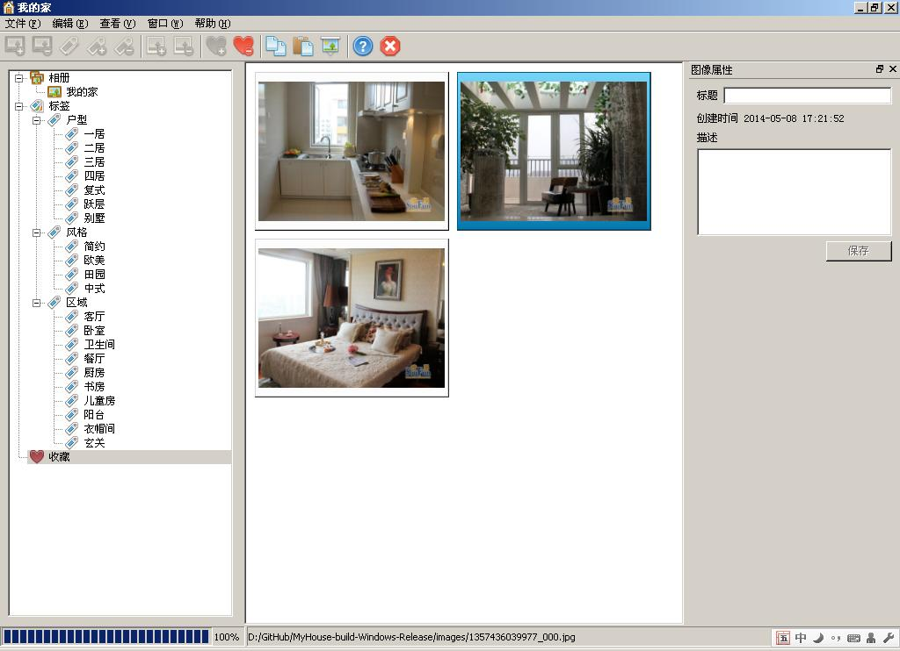
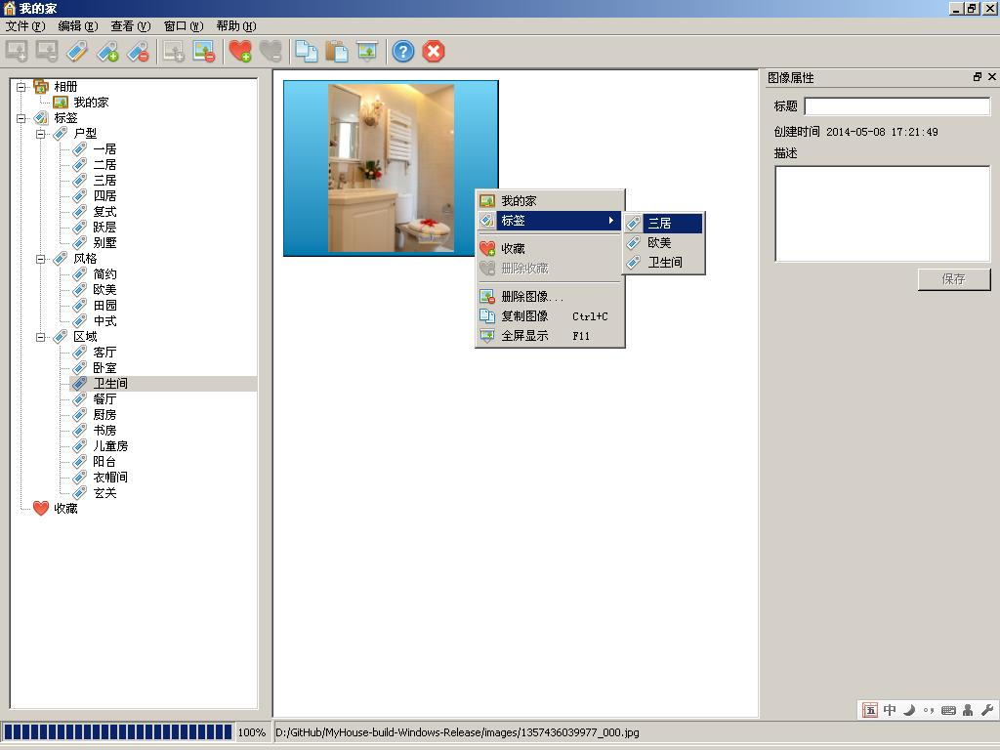

#My House

##我的家-图片管理器

##背景
本程序最初是自己在装修房子的时候需要收集装修的效果图，找来作参考，开发了这个程序用来收集图片。

##功能
创建、编辑、删除相册。

创建、编辑、删除标签。

一次增加多个图片。

加入剪切板中的图片。

拷贝选中的图片到剪切板中。

通过拖拽图片进行打标签，标签可以是多个。

编辑图片的属性（标题和描述）。

收藏好的图片。

以幻灯片的方式来浏览相册。

##截图
###主界面

###增加图片

###编辑图片属性

###收藏的图片

###相册、标签和收藏之间的快捷跳转

